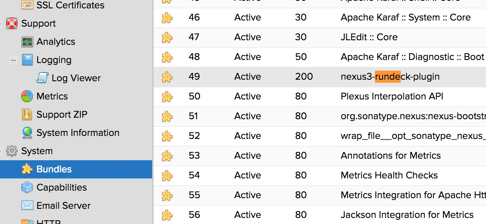
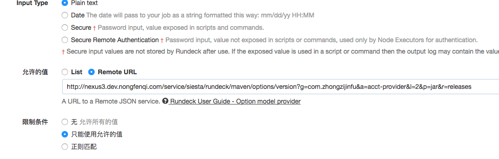
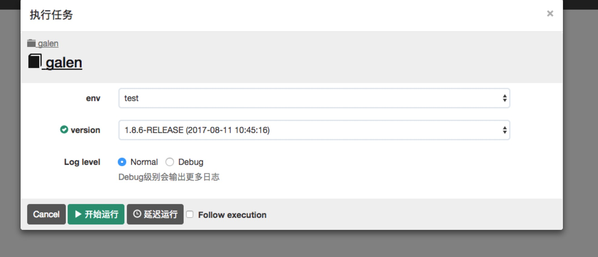

# Nexus3 Rundeck plugin

<https://github.com/nongfenqi/nexus3-rundeck-plugin>

## How to install

link: https://books.sonatype.com/nexus-book/3.0/reference/bundle-development.html#bundle-development-installing

## Usage

If you installed and the bundle is activeed, like this.
 

Now you can add url options from the nexus3 to rundeck.

### Maven repository

The plugin provides the following new HTTP resources :

- `http://NEXUS_HOST/service/siesta/rundeck/maven/options/version` : return a json array with the version of the matching artifacts.
  Parameters (all optional) :
  - `r` : repository ID to search in (null for searching in all indexed repositories)
  - `g` : groupId of the artifacts to match
  - `a` : artifactId of the artifacts to match
  - `p` : packaging of the artifacts to match ('jar', 'war', etc)
  - `c` : classifier of the artifacts to match ('sources', 'javadoc', etc)
  - `l` : limit - max number of results to return (default 10)
  
- `http://NEXUS_HOST/service/siesta/rundeck/maven/options/content` : return artifact stream 
  Parameters (all required) :
  - `r` : repository ID to search in (null for searching in all indexed repositories)
  - `g` : groupId of the artifacts to match
  - `a` : artifactId of the artifacts to match
  - `v` : artifact version

Note that if you want to retrieve the artifact from your Rundeck script, you can use content api, example is:

    wget "http://NEXUS_HOST/service/siesta/rundeck/maven/options/content?r=reponame&g=${option.groupId}&a=${option.artifactId}&v=${option.version}" --content-disposition
  
### Docker repository

Welcome to contribute

### Npm repository
  
Welcome to contribute

## How to build

- Java 1.8
- run "./gradlew jar"

